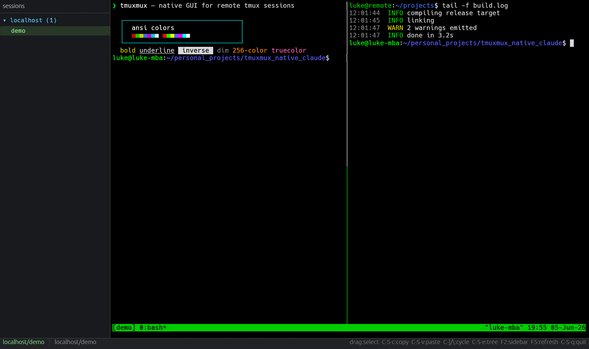
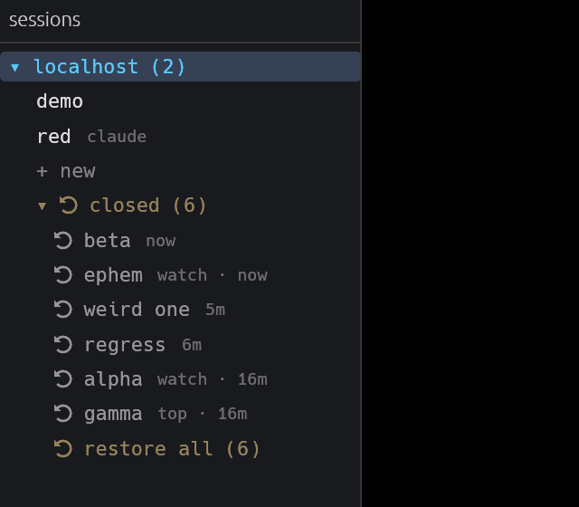
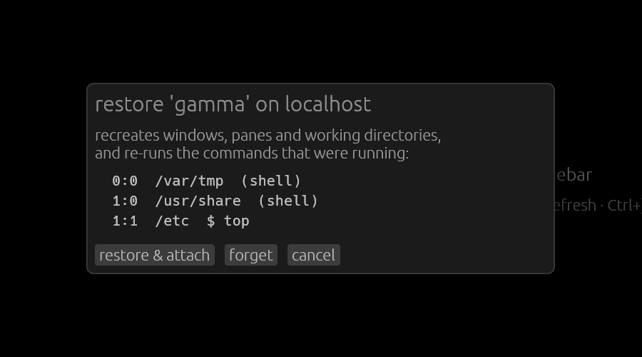

# tmuxmux

A fast native GUI for working across many tmux sessions on many machines.

tmuxmux connects to the hosts you give it, lists every tmux session it finds,
and attaches to them in its own dedicated terminal window — so your remote
sessions don't have to share a terminal with everything else you're doing.
Switching between sessions on different machines is one keystroke.



Built with Rust, [egui](https://github.com/emilk/egui),
[portable-pty](https://crates.io/crates/portable-pty) and
[vt100](https://crates.io/crates/vt100-ctt). One static binary, cross-platform
architecture (developed and tested on Linux, including Asahi/aarch64).

## Features

- **Session tree sidebar** — every host's tmux sessions, listed in parallel,
  one click (or Enter) to attach. Dead sessions reconnect on Enter.
- **Create sessions** — a `+ new` row under each host opens a name dialog
  (pre-filled with a colour name that doesn't clash with existing sessions)
  and creates-and-attaches in one shot via `tmux new-session -A`. Works the
  same on plain ssh hosts, the local machine and custom tunnel commands —
  no config changes needed.
- **Session cache & resurrection** — every host is snapshotted on a timer
  (windows, panes, layouts, working directories, and the full command line
  running in each pane, recovered from the remote process tree). Snapshots
  land in a local sqlite database. Sessions that vanish — a closed window,
  or a whole VM rebooting — appear under a dim `⟲ closed (N)` group in the
  sidebar: restore one (windows, splits, cwds and commands re-created and
  re-run) or `⟲ restore all` to repopulate a freshly rebooted machine.
  Cached cwds that no longer exist fall back to `$HOME` instead of failing.
- **Live hints** — the sidebar shows what's running in each session
  ("claude", "vim", …) and refreshes itself from the same snapshots; F5
  forces a poll.
- **App-manager integration** — point tmuxmux at a [geocam apps-manager]
  instance (`[[app_managers]]` = domain + username/password) and on launch it
  logs in, pulls every app you can reach, and materialises each as a host —
  grouped in the sidebar as **instance → mine / shared / public → app →
  sessions**, with each app's live status. Discovered apps are written back
  into `hosts.toml` below an auto-generated marker (new ones added, existing
  kept, vanished ones marked closed); your hand-written hosts above the marker
  are never touched. Multiple instances supported.
- **Progress pane** — a third pane, right of the terminal, that live-renders
  a `PROGRESS.md` at the git root of the active session's working directory
  (fetched over ssh for remote sessions). It appears only when that file
  exists, so it costs no space otherwise. The bundled `progress-log` skill
  teaches an LLM to keep that file as a low-energy re-entry briefing — a
  rewritten "Now" callout plus newest-first dated entries — rather than a
  manual. `Ctrl+Shift+L` hides/shows it. Sessions that have a log get a small
  amber dot in the sidebar (detected in the same per-host snapshot sweep, so
  it's one probe per host, not per session), so you can see at a glance which
  of many sessions have context waiting.

<p align="center">
  
  
</p>
- **Real terminal emulation** — 256-color and truecolor, bold/dim/underline/
  inverse, box-drawing (including DEC special graphics translation, so
  curses apps and tmux borders render as lines, not `qqqq`), block cursor,
  bracketed paste, application cursor keys.
- **Selection & clipboard** — drag to select, `Ctrl+Shift+C` / `Ctrl+Shift+V`
  to copy/paste. Plain `Ctrl+C` still sends SIGINT like a terminal should.
- **Mouse passthrough** — clicks, drags and wheel are forwarded to tmux when
  the app requests mouse reporting (hold Shift to select locally instead).
- **Flexible connections** — plain ssh (aliases, FQDNs, IPs), the local
  machine, or an arbitrary command line for jump hosts / sshpass /
  cloudflared tunnels.
- **Scriptable** — a `--script` mode drives the app headlessly (attach, send
  keys, screenshot, select, copy) for testing and automation.

## Install

```sh
git clone https://github.com/qume/tmuxmux
cd tmuxmux
cargo build --release
# binary at target/release/tmuxmux
```

On machines with ≤8 GB RAM, build with `cargo build --release -j 3` to keep
parallel rustc instances from exhausting memory.

## Configure

Copy [`hosts.toml.example`](hosts.toml.example) to `hosts.toml` and edit.
The config is searched for next to the binary, in the current directory,
then in `~/.config/tmuxmux/hosts.toml`.

```toml
[[hosts]]
name = "localhost"
local = true

# Anything ssh can resolve; key-based auth (BatchMode) is assumed.
[[hosts]]
name = "buildbox"

# Full custom command for tunnels/jump hosts — tmux attach is appended.
[[hosts]]
name = "tunnelled-app"
command = "sshpass -p secret ssh -tt -o ProxyCommand='cloudflared access ssh --hostname app-ssh.example.com' dev@app-ssh.example.com"
```

tmux is attached with `-u`, so box-drawing arrives as UTF-8 even though ssh
doesn't forward your locale.

The session cache is on by default (sqlite at
`~/.local/share/tmuxmux/sessions.db`, hosts polled every 60 s, closed
sessions kept 30 days). Tune or relocate it with an optional `[cache]`
section:

```toml
[cache]
interval_secs = 60     # 0 = only snapshot at startup and on F5
retention_days = 30
# path = "/somewhere/else/sessions.db"
```

`--db PATH` and `--cache-interval SECS` override the config; `--dump-cache`
prints everything the cache knows and exits.

## Keys

| Key | Action |
|---|---|
| drag | select text |
| `Ctrl+Shift+C` | copy selection |
| `Ctrl+Shift+V` | paste |
| `Ctrl+click` | open URL under cursor |
| `Ctrl+]` / `Ctrl+\` | next / previous session |
| `Ctrl+Shift+E` | focus the session tree |
| `Ctrl+=` / `Ctrl+-` | bigger / smaller font (`Ctrl+0` resets) |
| `Ctrl+Shift+L` | hide / show the progress pane |
| `F2` | toggle sidebar |
| `F5` | refresh session lists |
| `Ctrl+Shift+Q` | quit |

Everything else — including plain `Ctrl+C`/`Ctrl+V`, `Esc`, `Tab`, arrows and
F-keys — goes to the terminal. In the tree: arrows or `j`/`k` navigate,
`Enter` connects (or, on a `+ new` row, opens the create dialog).

## Scripting / testing

`--script` runs a `;;`-separated step list, so the app can be driven without
a human (screenshots land as PNGs, selection/clipboard print to stdout):

```sh
./target/release/tmuxmux --script \
  "sleep:1500;;attach:localhost/demo;;sleep:2000;;keys:ls\n;;sleep:500;;\
   shot:/tmp/shot.png;;select:0,0,2,40;;print-selection;;copy;;print-clipboard;;quit"
```

Steps: `sleep:MS`, `attach:HOST/SESSION`, `keys:TEXT` (`\n \r \t \e \xNN`),
`shot:PATH`, `select:R1,C1,R2,C2`, `copy`, `paste`, `print-selection`,
`print-clipboard`, `newmodal:HOST`, `modal-accept`, `snapshot-now`,
`restore:HOST/NAME`, `restoremodal:HOST/NAME`, `restore-all:HOST`,
`dump-live:HOST`, `dump-closed:HOST`, `quit`. There's also `--list` (print
each host's sessions and exit) and `--snap HOST` (print one parsed snapshot
and exit — handy for debugging capture).

Headless testing tip: the suite runs against a private compositor
(`weston --backend=headless --idle-time=0`) so a locked or sleeping desktop
can't stall it.

## Design notes

Pitfalls that bite terminal-emulator front-ends, all handled here:

- **vsync can freeze the whole app.** With vsync on, `eglSwapBuffers`
  blocks waiting for a compositor frame callback — which never arrives
  while the screen is locked, blanked, or the window is fully occluded.
  tmuxmux runs with vsync off and paces itself with egui's
  `request_repaint_after`.
- **tmux output mangles delimiters.** Snapshot parsing can't use control
  characters as field separators (tmux octal-escapes them on output) nor
  non-ASCII (hosts without a UTF-8 locale flatten it to `_`). Only
  printable ASCII survives everywhere.

- **Default colors are asymmetric.** A vt100 cell reports `Color::Default`
  for both unset foregrounds *and* unset backgrounds — but they must resolve
  differently (light text, black background). Map them through one converter
  and every uncolored cell gets a painted-over background.
- **DEC special graphics still exist.** When tmux thinks a client can't do
  UTF-8 (e.g. ssh didn't forward a locale), it downgrades box-drawing to the
  alternate character set (`ESC(0`, where `q` is `─`). tmuxmux both forces a
  UTF-8 client (`tmux -u`) and translates ACS to Unicode in an
  escape-sequence-aware filter (`src/acs.rs`) for everything else.

## License

[MIT](LICENSE)
